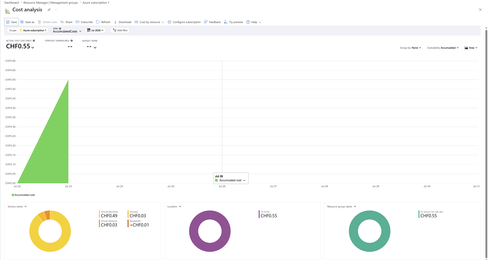

# Azure Secure VM Lab

## Overview

The Azure Secure VM Lab is a portfolio project demonstrating the deployment of a security-focused Azure environment using Infrastructure as Code (IaC).

The project provisions an Ubuntu virtual machine, virtual network, management subnet, Network Security Group and supporting Azure resources through Bicep. PowerShell scripts automate deployment, validation and cleanup to provide a consistent deployment lifecycle.

## Key Features

- Infrastructure as Code using Bicep
- Ubuntu Linux virtual machine
- Virtual Network with management subnet
- Network Security Group restricting inbound SSH access
- SSH key authentication
- PowerShell deployment, validation and cleanup automation
- Consistent resource naming and tagging
- Validation checklist
- Cost-aware deployment lifecycle
- Comprehensive technical documentation

---

## Architecture Summary

The lab deploys a secure Azure environment consisting of:

- Resource Group
- Virtual Network
- Management Subnet
- Network Security Group
- Public IP Address
- Network Interface
- Ubuntu Linux Virtual Machine

The environment follows secure defaults by restricting inbound access, using SSH key authentication and separating deployment configuration from infrastructure code.

For detailed architecture information, see **[ARCHITECTURE](docs/ARCHITECTURE.md)**.

---

## Technology Stack

| Technology | Purpose |
|------------|---------|
| Microsoft Azure | Cloud Platform |
| Bicep | Infrastructure as Code |
| PowerShell 7 | Deployment Automation |
| Azure CLI | Azure Management |
| OpenSSH | Secure Remote Access |
| Git & GitHub | Version Control |
| Markdown | Project Documentation |

---

## Repository Structure

```text
azure-secure-vm-lab/
│
├── bicep/
│   ├── main.bicep
│   └── main.bicepparam
│
├── docs/
│   ├── images/
│   │   ├── v1.0.0/
│   ├── ARCHITECTURE.md
│   ├── DEPLOYMENT.md
│   ├── DEVELOPMENT_JOURNAL.md
│   ├── LESSONS_LEARNED.md
│   ├── SECURITY.md
│   └── TROUBLESHOOTING.md
│
├── scripts/
│   ├── cleanup.ps1
│   ├── deploy.ps1
│   └── validate.ps1
│
├── tests/
│   └── validation-checklist.md
│
├── CHANGELOG.md
└── README.md
```

---

## Prerequisites

To deploy this project you will need:

- Azure CLI
- Bicep CLI
- PowerShell 7
- Git
- An active Azure subscription
- An SSH key pair

---

## Deployment

The project is deployed using the supplied PowerShell automation scripts:

- `deploy.ps1`
- `validate.ps1`
- `cleanup.ps1`

For the complete deployment procedure, prerequisites and validation steps, see **[Deployment Guide](docs/DEPLOYMENT.md)**.

---

## Validation

Version 1.0.0 was validated by confirming:

- Successful infrastructure deployment
- SSH key authentication
- Network Security Group configuration
- Deployment parameter validation
- Resource cleanup

Detailed validation results are available in the
**[Validation Checklist](tests/validation-checklist.md)**.

---

## Cost

Version 1.0.0 incurred an approximate Azure cost of **CHF 0.55** during development and validation before the environment was removed.

Actual costs will vary depending on region, VM size and deployment duration.



---

## Project Evidence

Supporting screenshots captured during development and validation are stored under:

[Images](docs/images/v1.0.0/)

Representative screenshots are referenced throughout the documentation where they provide supporting evidence. Additional screenshots are retained as an archive of the implementation, deployment, validation, troubleshooting, cleanup and cost verification process.

---

## Project Documentation

- [ARCHITECTURE](docs/ARCHITECTURE.md)
- [DEPLOYMENT](docs/DEPLOYMENT.md)
- [SECURITY](docs/SECURITY.md)
- [DEVELOPMENT JOURNAL](docs/DEVELOPMENT_JOURNAL.md)
- [LESSONS LEARNED](docs/LESSONS_LEARNED.md)
- [TROUBLESHOOTING](docs/TROUBLESHOOTING.md)
- [CHANGELOG](CHANGELOG.md)

---

## Roadmap

### Version 1.1.0

- Azure Monitor
- Log Analytics Workspace
- Basic monitoring documentation

### Version 1.2.0

- Governance improvements
- RBAC exercises
- Resource locks
- Enhanced tagging

### Version 1.3.0

- Linux hardening
- Microsoft Defender for Cloud
- Additional security controls

### Version 2.0.0

- Modular Bicep architecture
- Private networking
- Azure Bastion
- CI/CD deployment pipeline
- Expanded Azure infrastructure

---

## License

This project is licensed under the MIT License.

---

## Author

**Matthew Wilson**

Created as part of a cloud engineering and infrastructure portfolio demonstrating Azure administration, Infrastructure as Code and secure deployment practices.