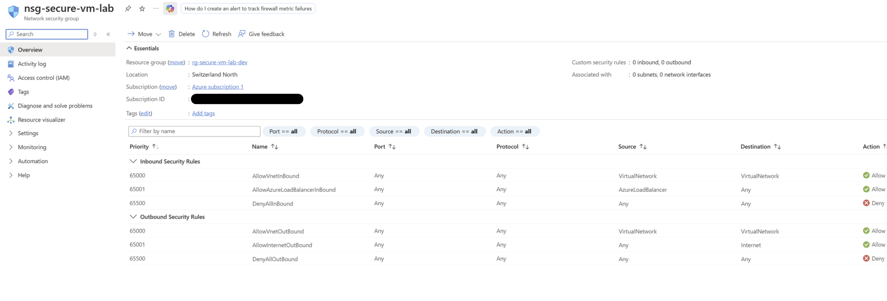

# Security Guide

This document describes the security controls implemented in Version 1.0.0 of the Azure Secure VM Lab.

The project demonstrates secure-by-default infrastructure using Microsoft Azure, Bicep and PowerShell. Only security controls that were implemented and validated are documented.

---

## Security Objectives

The primary security objectives for Version 1.0.0 were to:

- Deploy infrastructure using Infrastructure as Code.
- Eliminate password-based remote authentication.
- Restrict administrative access to authorised sources.
- Minimise the attack surface.
- Avoid storing secrets within the repository.
- Deploy a repeatable and reproducible environment.

---

## Identity and Authentication

Administrative access to the Ubuntu virtual machine is provided using SSH public key authentication.

Version 1.0.0 does not use password authentication for remote access.

This approach reduces the risk of password-based attacks while supporting secure remote administration.

---

## Network Security

The virtual machine is protected by an Azure Network Security Group (NSG).

The implemented network controls include:

- SSH access restricted to an authorised public IP address.
- No unnecessary inbound ports exposed.
- Explicit inbound access rules.
- Azure virtual networking for resource isolation.

### NSG Overview

---

## Infrastructure as Code

All Azure infrastructure is defined using Bicep.

Benefits include:

- Repeatable deployments.
- Consistent resource configuration.
- Version-controlled infrastructure.
- Reduced manual configuration errors.

---

## Secrets Management

Version 1.0.0 avoids committing sensitive information to source control.

The repository does not contain:

- SSH private keys
- Azure credentials
- passwords
- connection strings
- secrets

Deployment-specific configuration is separated through the Bicep parameter file.

---

## Resource Tagging

Azure resources are tagged to support:

- resource identification
- management
- governance
- future cost reporting

---

## Security Validation

The following controls were successfully validated:

- SSH key authentication
- Network Security Group configuration
- Restricted SSH access
- Successful secure SSH connection
- Deployment validation
- Resource cleanup

---

## Planned Security Improvements

Future versions may introduce:

- Azure Bastion
- Private administration
- Microsoft Defender for Cloud
- Azure Monitor security alerts
- RBAC exercises
- Resource locks
- Linux hardening
- Automated security validation
- CI/CD security integration

---

## Related Resources

### Infrastructure

- [main.bicep](../bicep/main.bicep)
- [main.bicepparam](../bicep/main.bicepparam)

### Automation

- [deploy.ps1](../scripts/deploy.ps1)
- [validate.ps1](../scripts/validate.ps1)
- [cleanup.ps1](../scripts/cleanup.ps1)

### Validation

- [Validation Checklist](../tests/validation-checklist.md)

---

## Related Documentation

- [README](../README.md)
- [ARCHITECTURE](ARCHITECTURE.md)
- [DEPLOYMENT](DEPLOYMENT.md)
- [LESSONS LEARNED](LESSONS_LEARNED.md)
- [TROUBLESHOOTING](TROUBLESHOOTING.md)
- [CHANGELOG](../CHANGELOG.md)