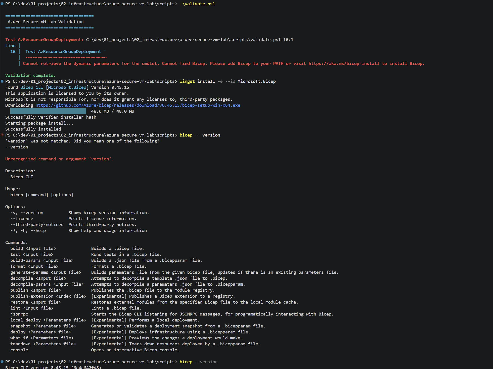
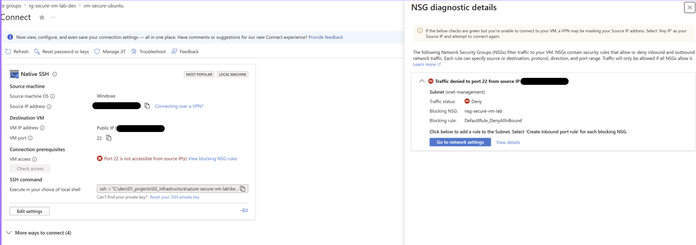
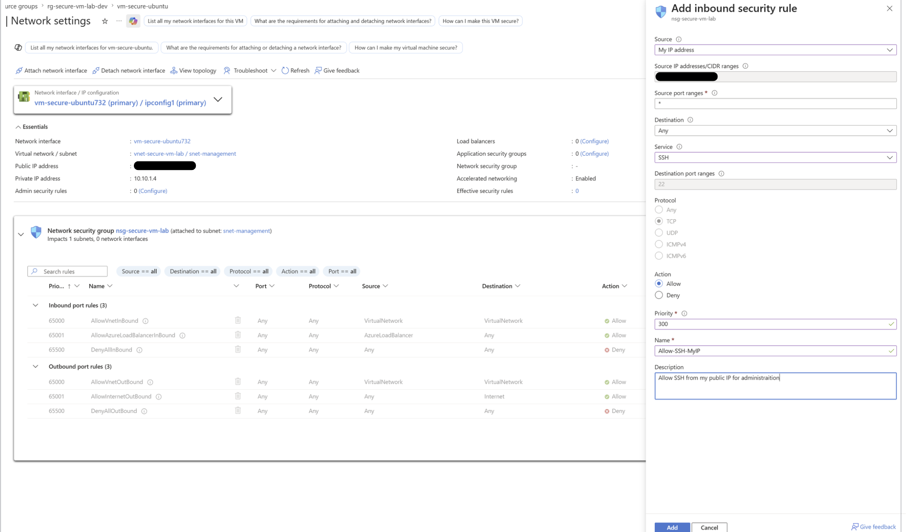
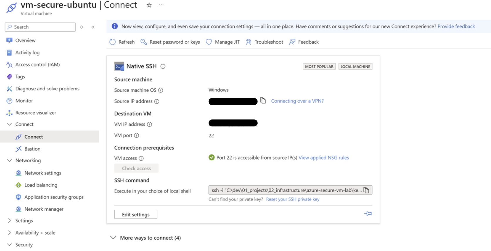
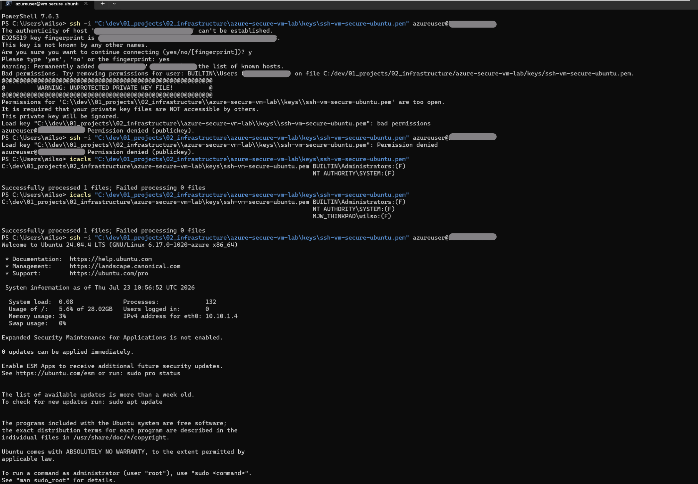
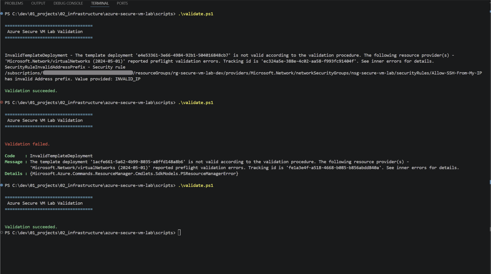

# Troubleshooting

This document records genuine issues encountered during the development of the Azure Secure VM Lab project.

Each entry documents the symptoms, root cause, resolution and verification steps to provide a reusable reference for future deployments.

---

## Issue 1 – Bicep CLI Not Installed

**Date:** 2026-07-23

### Problem

The deployment scripts could not locate the Bicep CLI.

### Symptoms

- `Cannot find Bicep.`
- Deployment validation failed before execution.

### Cause

The Azure Bicep CLI had not been installed on the local development machine.

### Solution

Installed the Bicep CLI using:

```powershell
winget install -e --id Microsoft.Bicep
```

Verified the installation:

```powershell
bicep --version
```

### Verification

The deployment scripts successfully detected the installed Bicep CLI and executed normally.

### Evidence



### Prevention

Verify required tooling before beginning a deployment.

---

## Issue 2 – SSH Access Blocked by Network Security Group

**Date:** 2026-07-23

### Problem

SSH connections to the Ubuntu virtual machine failed.

### Symptoms

- Azure indicated that port 22 was inaccessible.
- The NSG diagnostics showed that the connection was being denied.

### Cause

The Network Security Group did not contain an inbound rule permitting SSH traffic from the authorised public IP address.

### Solution

Created an inbound NSG rule allowing TCP port 22 from the authorised public IP address only.

### Verification

SSH connections succeeded after the rule was applied.

### Evidence

## Issue 1 – Bicep CLI Not Installed

**Date:** 2026-07-23

### Problem

The deployment scripts could not locate the Bicep CLI.

### Symptoms

- `Cannot find Bicep.`
- Deployment validation failed before execution.

### Cause

The Azure Bicep CLI had not been installed on the local development machine.

### Solution

Installed the Bicep CLI using:

```powershell
winget install -e --id Microsoft.Bicep
```

Verified the installation:

```powershell
bicep --version
```

### Verification

The deployment scripts successfully detected the installed Bicep CLI and executed normally.

### Evidience






### Prevention

Validate NSG rules immediately after deployment.

---

## Issue 3 – SSH Private Key Permissions

**Date:** 2026-07-23

### Problem

OpenSSH refused to use the private key.

### Symptoms

```
UNPROTECTED PRIVATE KEY FILE
```

### Cause

The private key file inherited Windows permissions that were considered too permissive by OpenSSH.

### Solution

Restricted the file permissions using Windows security settings and verified them with:

```powershell
icacls
```

### Verification

SSH authentication succeeded using the private key.

### Evidence



### Prevention

Store private keys with restricted permissions before first use.

---

## Issue 4 – Invalid NSG Source Address Prefix

**Date:** 2026-07-23

### Problem

Deployment validation failed.

### Symptoms

Azure reported an invalid source address prefix.

### Cause

A placeholder IP address had not been replaced with the authorised public IP address.

### Solution

Updated the deployment parameters with the correct public IP address using CIDR notation.

### Verification

Deployment validation completed successfully.

### Evidence



### Prevention

Review deployment parameters before validation.

---

## Issue 5 – Validation Script Reported Success Incorrectly

**Date:** 2026-07-23

### Problem

The validation script displayed a successful validation message even when validation failed.

### Symptoms

Validation output always indicated success.

### Cause

The script relied solely on exception handling rather than inspecting the validation result returned by Azure.

### Solution

Updated the script to evaluate the returned validation object before reporting success.

### Verification

The script now correctly distinguishes successful and failed validation results.

### Evidence


### Prevention

Do not assume command success solely because no exception was raised.

---

## Issue 6 – Initial SSH Connection Closed Immediately After Deployment

**Date:** 2026-07-23

### Problem

The first SSH connection terminated immediately after deployment.

### Symptoms

The SSH client connected successfully before the remote host closed the session.

### Cause

The virtual machine was still completing its cloud-init configuration immediately after deployment.

### Solution

Waited briefly before reconnecting.

### Verification

The second connection succeeded without further changes.

### Prevention

Allow sufficient time for cloud-init to complete before attempting the initial SSH session.

---

## Related Documentation

- [README](../README.md)
- [CHANGELOG](../CHANGELOG.md)
- [ARCHITECTURE](ARCHITECTURE.md)
- [DEPLOYMENT](DEPLOYMENT.md)
- [SECURITY](SECURITY.md)
- [LESSONS LEARNED](LESSONS_LEARNED.md)